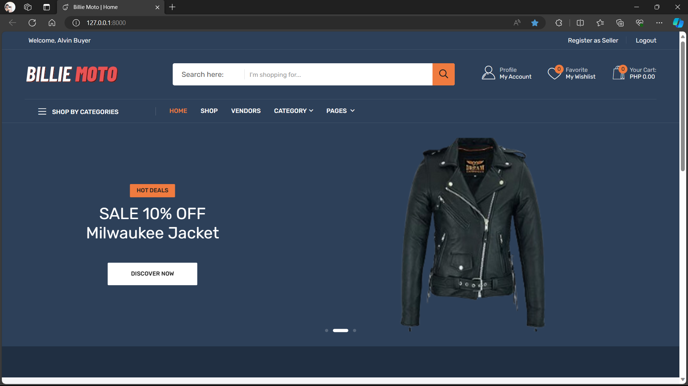
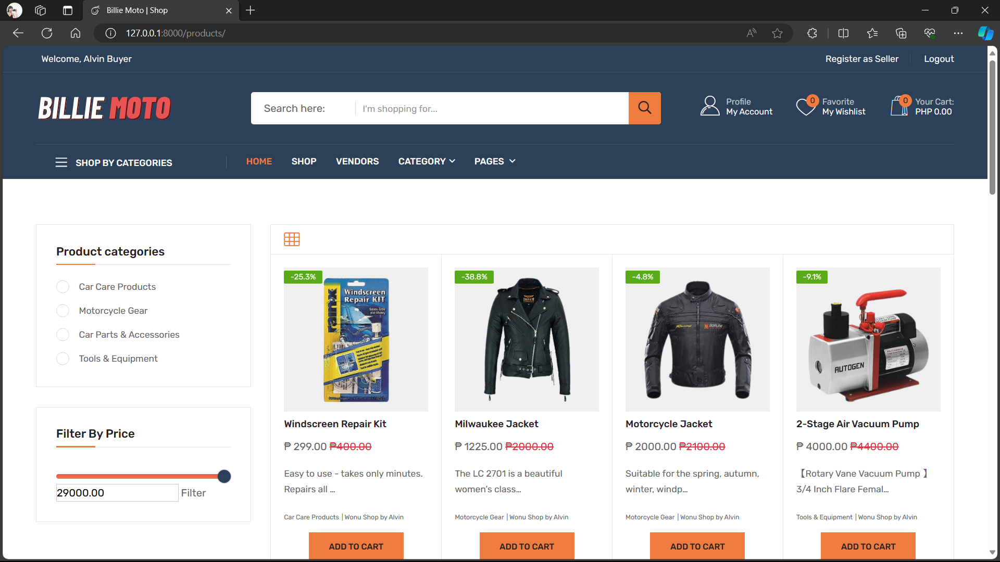
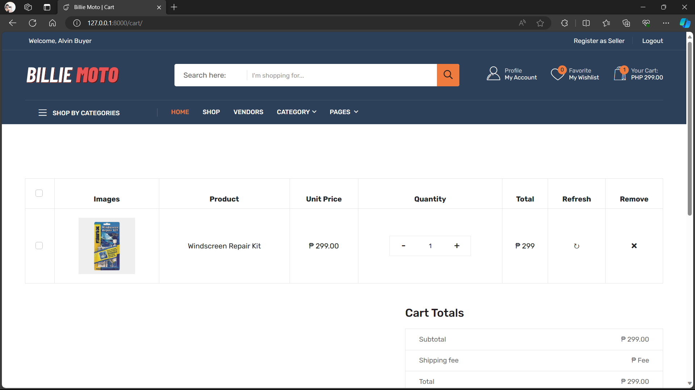
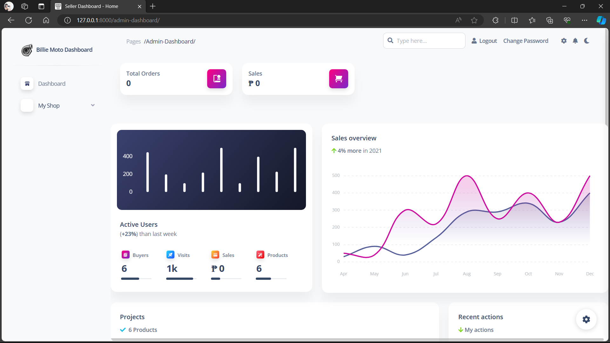
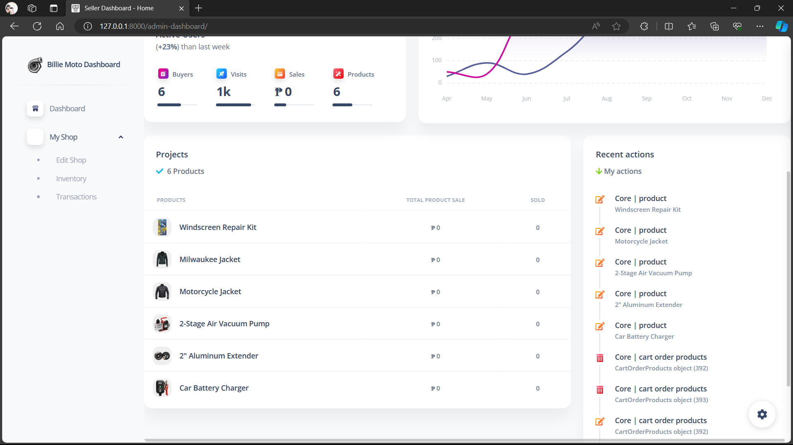
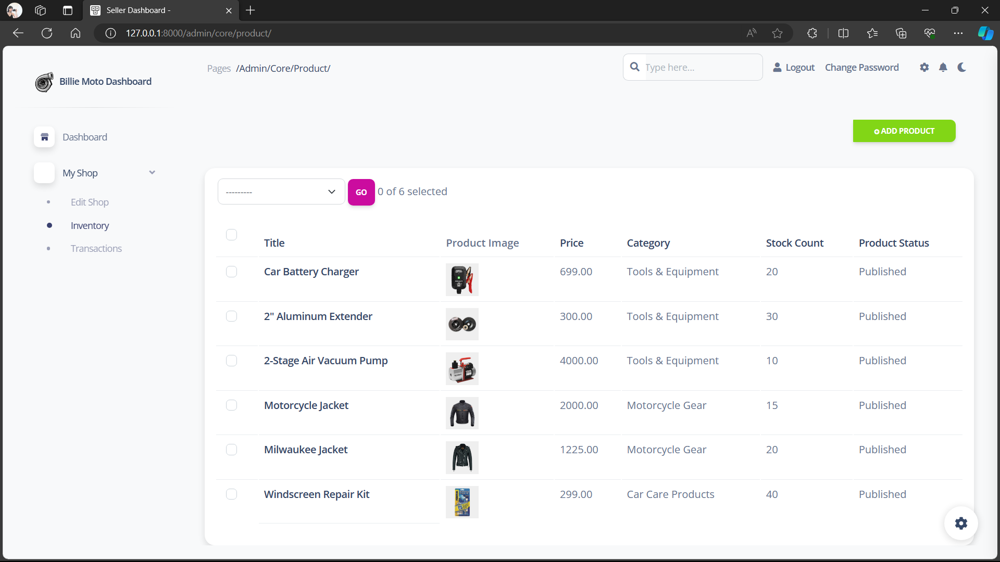

# Multi Seller ERP
###### © Alvin R. of Billie Motto 

## Description
- Developed using Python - Django Framework, SQLite3, HTML-CSS-JavaScript.

## Installation

python manage.py makemigrations
python manage.py migrate
python manage.py runserver

## Credits

Admin Dashboard appseed.us

## Developed using 

## Preview

        

## Features

- Buyer
- Seller
- Wishlist
- Add to cart
- Register as seller
- Add edit delete products
- Monitor product stocks
- Monitor product sales

### © Alvin R.
